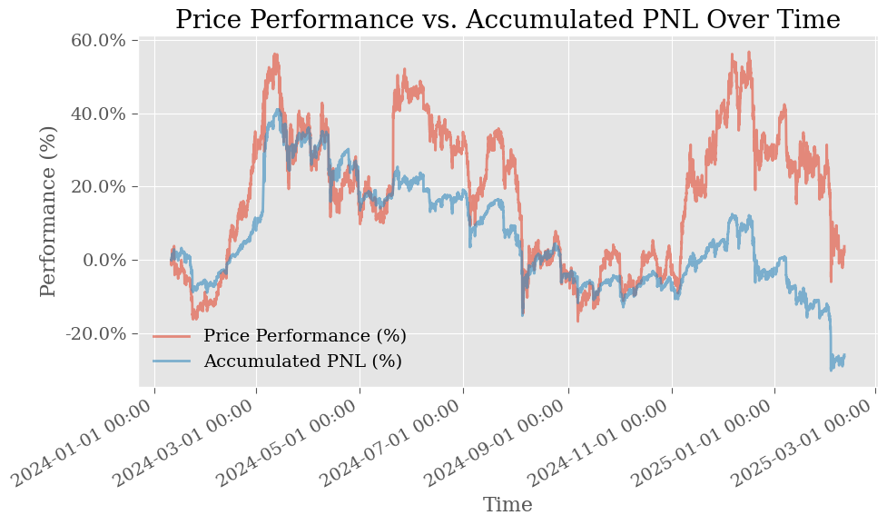

# Optimizing Uniswap V3 Liquidity Provision: Tau-Reset Strategies

## Abstract

This research explores advanced liquidity provision strategies for Uniswap V3, focusing on variations of the τ (tau) reset strategy. I compare basic τ-reset approach with different implementations: volatility adjustments, multi-position distribution, and cross-asset correlation. My findings suggest that dynamic range adjustment based on market conditions can improve returns compared to static liquidity provision strategies.

## Introduction

Uniswap V3's concentrated liquidity feature allows liquidity providers to allocate capital within specific price ranges, potentially increasing capital efficiency. However, this creates an active management problem: how to optimally adjust these ranges as market conditions change. This research explores several strategies for this problem using the Fractal DeFi framework.

## Methodology

### Data Sources
- Uniswap V3 pool data from The Graph API
- Price data from Binance
- Time period: January 2024 - March 2024
- Primary pools: ETH/USDT
 (0x8ad599c3a0ff1de082011efddc58f1908eb6e6d8)
- Fidelity is **hour**. We have enough data, this is an ontimal desicion to smooth price data

I believe that choose of instrument is not primary, because efficient strategy should provide hypotises, true and realistic conclusions. Here are strategies algorhytms 

### Strategies Implemented

#### 1. Basic τ-Reset Strategy
The baseline strategy that repositions liquidity when price moves outside a fixed range determined by the τ parameter

#### 2. ATR-based τ-Reset Strategy
Extends the basic strategy by dynamically adjusting the τ parameter based on market volatility measured through the Average True Range (ATR) indicator.

```python
def _get_adjusted_tau(self, current_price: float) -> float:
    if self.atr is None or current_price == 0:
        return self._params.TAU
    
    volatility = self.atr / current_price
    adjusted_tau = self._params.TAU * self._params.TAU_SCALING_FACTOR
    
    return max(self._params.MIN_TAU, min(self._params.MAX_TAU, adjusted_tau))
```

#### 3. Timed τ-Reset Strategy
This is approach when time-based rebalancing happens independently of price movement triggers, allowing for periodic position adjustments regardless of price action. This is another static "benchmark" to not make overfitted or false positive conclusions

#### 4. Distribution τ-Reset Strategy
Creates multiple liquidity positions across different price ranges based on trading volume distribution:

- Analyzes historical volume across price bins
- Places concentrated liquidity in areas with highest trading activity
- Adjusts position widths dynamically using ATR-based volatility measurements
- Implements position overlap to ensure continuous liquidity coverage
- Correctly handles penalties for open positions

#### 5. Correlation τ-Reset Strategy
I believe that all big background(news, events, etc) affects huge standard instruments(such as BTC), so we can use it to estimate the risk

Strategy adjusts position ranges based on correlations between the pool asset and external instruments:
 
- Analyzes price correlations between Uniswap asset and external references (BTC)
- Uses smaller ranges when correlation is high (more predictable movements)
- Uses wider ranges when correlation is low (capturing unpredictable price action)
- Dynamically selects optimal range widths based on correlation strength

### Evaluation Metrics
- Fee generation
- Rebalancing frequency and associated penalties
- All standard backtest metrics(sharpe, drawdown, pnl, etc)

## Experimental Setup

All strategies were evaluated using the MLflow experimentation platform. For each strategy, we explored a range of hyperparameters. Built grids are in ***_pipeline.py** files
## Results

### Strategy Performance Comparison

[Some Images]


## Key Findings

1. [Key finding about PnL(not main factor)]

2. [Key finding about MLflow optimizations]

3. [Key finding about Fees generation]

4. [Key finding about market conditions most favorable for each strategy]

5. [Key finding about rebalancing frequency and its impact]


## Limitations

- Limited historical data (only Q1 2024)
- Gas fees not fully accounted for in the simulation
- Slippage effects not modeled
- Limited to specific Uniswap V3 pools


## Conclusion

[Overall conclusion about the most effective liquidity provision strategies]


## Code Repository Structure

- `tau_strategy.py`: Implementation of basic τ-reset strategy
- `atr_tau_strategy.py`: Implementation of ATR-based τ-reset strategy
- `timed_tau_strategy.py`: Implementation of time-based τ-reset strategy
- `distribution_tau_strategy.py`: Implementation of distribution-based multi-position strategy
- `correlation_tau_strategy.py`: Implementation of correlation-based τ-reset strategy
- `*_observations.py`: Data loaders for each strategy
- `*_pipeline.py`: MLflow experiment pipelines for each strategy